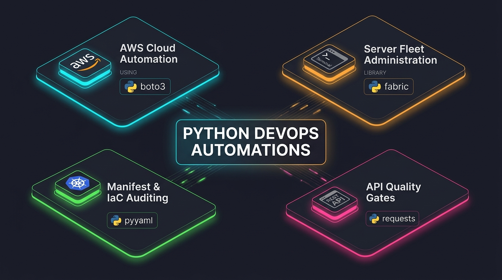

# Python DevOps Automations



[](https://www.python.org/downloads/)
[](https://boto3.amazonaws.com/v1/documentation/api/latest/index.html)
[](https://www.fabfile.org/)
[](https://pyyaml.org/)
[](https://requests.readthedocs.io/)

A comprehensive collection of real-world DevOps automation scripts written in Python. This repository showcases how to solve core cloud operations, remote server administration, infrastructure auditing, and CI/CD quality gate challenges using **four essential Python libraries**:

1. **[`boto3`](boto3/readme.md)** — AWS Cloud Automation, Governance & Cost Optimization
2. **[`fabric`](fabric/readme.md)** — Remote Server Administration & Fleet Operations over SSH
3. **[`pyyaml`](pyyaml/readme.md)** — Kubernetes & CI/CD Workflow Manifest Auditing
4. **[`requests`](requests/readme.md)** — REST API DevOps Integrations & Observability Health Gates

---

## 🛠️ Repository Architecture

```text
python-aws-automations/
├── boto3/             # AWS Cloud Automation & Security Audits
├── fabric/            # SSH Remote Server Fleet Management
├── pyyaml/            # Kubernetes & GitHub Actions Manifest Auditing
├── requests/          # REST API Operations & Deployment Gates
└── requirements.txt   # Python Dependencies
```

---

## 📚 Modules & Real-World Use Cases

### 1. AWS Cloud Automation ([boto3/](boto3/readme.md))
Focuses on AWS resource discovery, cost reduction, tag compliance, security auditing, and backup management using the AWS SDK for Python.

| Script | Purpose / Real-World Use Case |
| :--- | :--- |
| **[`boto3/inventory.py`](boto3/inventory.py)** | Scans AWS region and compiles an inventory of EC2, EBS, RDS, ALB, Lambda, EKS, and ECR. |
| **[`boto3/multiaccount_inventory.py`](boto3/multiaccount_inventory.py)** | Cross-account scanning via IAM AssumeRole across AWS Organizations. |
| **[`boto3/unused_resources.py`](boto3/unused_resources.py)** | Detects unattached EBS volumes, unassociated EIPs, stopped EC2 instances, and stale snapshots. |
| **[`boto3/ec2_scheduler.py`](boto3/ec2_scheduler.py)** | Starts/stops tag-filtered (`AutoSchedule=true`) non-production EC2 instances. |
| **[`boto3/ebs_snapshot_manager.py`](boto3/ebs_snapshot_manager.py)** | Automated EBS volume snapshot creation and retention management. |
| **[`boto3/cost_report.py`](boto3/cost_report.py)** | Fetches monthly spending breakdowns via AWS Cost Explorer API. |
| **[`boto3/tag_compliance_checker.py`](boto3/tag_compliance_checker.py)** | Audits resources for required tags (`Environment`, `Owner`, `Project`). |
| **[`boto3/security_group_auditor.py`](boto3/security_group_auditor.py)** | Identifies dangerous public ingress rules (`0.0.0.0/0`) on sensitive ports (22, 3389, 3306, 5432). |
| **[`boto3/iam_security_auditor.py`](boto3/iam_security_auditor.py)** | Audits IAM users for missing MFA, stale access keys, and direct inline policy attachments. |
| **[`boto3/s3_governance_auditor.py`](boto3/s3_governance_auditor.py)** | Checks S3 buckets for public access block, default encryption, versioning, and logging. |
| **[`boto3/cloudwatch_alarm_auditor.py`](boto3/cloudwatch_alarm_auditor.py)** | Verifies CloudWatch alarm coverage across running EC2 instances. |
| **[`boto3/cloudwatch_health_report.py`](boto3/cloudwatch_health_report.py)** | Generates composite health status reports (Healthy/Warning/Critical) for servers. |
| **[`boto3/ecr_image_cleanup.py`](boto3/ecr_image_cleanup.py)** | Identifies and cleans up untagged or old container images in Amazon ECR. |
| **[`boto3/lambda_rollback.py`](boto3/lambda_rollback.py)** | Safely rolls back Lambda function aliases to previous published versions. |
| **[`boto3/route53_acm_auditor.py`](boto3/route53_acm_auditor.py)** | Monitors Route 53 DNS records and ACM SSL certificate expiration dates. |
| **[`boto3/ssm_remote_health_check.py`](boto3/ssm_remote_health_check.py)** | Agentless Linux EC2 health inspection via AWS Systems Manager Run Command. |

---

### 2. Remote Server Management ([fabric/](fabric/readme.md))
Provides agentless Linux server administration, diagnostic collection, and service management over SSH using `Fabric`.

| Script | Purpose / Real-World Use Case |
| :--- | :--- |
| **[`fabric/server_bootstrap.py`](fabric/server_bootstrap.py)** | Provisions fresh Ubuntu/Debian VMs with system packages, user accounts, and directory structure. |
| **[`fabric/multi_server_health_check.py`](fabric/multi_server_health_check.py)** | Executes parallel system health checks (uptime, disk, memory, systemd failures) over SSH. |
| **[`fabric/nginx_config_deployer.py`](fabric/nginx_config_deployer.py)** | Uploads Nginx configs, runs syntax checks (`nginx -t`), and handles automatic rollbacks on error. |
| **[`fabric/remote_service_manager.py`](fabric/remote_service_manager.py)** | Restarts and audits systemd services across remote server fleets using sudo. |
| **[`fabric/remote_log_collector.py`](fabric/remote_log_collector.py)** | Pulls application and system logs locally from multiple servers during troubleshooting. |
| **[`fabric/incident_diagnostics_collector.py`](fabric/incident_diagnostics_collector.py)** | Collects process trees, CPU/memory stats, and error logs during active production incidents. |

---

### 3. Manifest & IaC Auditing ([pyyaml/](pyyaml/readme.md))
Parses, audits, and mutates YAML configuration files to enforce security and operational compliance.

| Script | Purpose / Real-World Use Case |
| :--- | :--- |
| **[`pyyaml/kubernetes_manifest_auditor.py`](pyyaml/kubernetes_manifest_auditor.py)** | Audits K8s Deployment manifests for missing CPU/memory limits, probes, and non-root security contexts. |
| **[`pyyaml/githubactions_workflow_auditor.py`](pyyaml/githubactions_workflow_auditor.py)** | Scans `.github/workflows` for security risks (unpinned Action SHAs, plain-text secrets, missing timeouts). |
| **[`pyyaml/bulk_manifest_updater.py`](pyyaml/bulk_manifest_updater.py)** | Batch updates container image tags across multiple Kubernetes manifests with automatic backups. |

---

### 4. API Operations & Quality Gates ([requests/](requests/readme.md))
Automates REST API calls, continuous delivery verification, and observability health checks.

| Script | Purpose / Real-World Use Case |
| :--- | :--- |
| **[`requests/deployment_verifier.py`](requests/deployment_verifier.py)** | Automated post-deployment testing against `/health`, `/ready`, and `/version` endpoints. |
| **[`requests/prometheus_health_gate.py`](requests/prometheus_health_gate.py)** | PromQL deployment gate evaluating 5xx error rates, p95 latency, and target availability. |
| **[`requests/github_repository_auditor.py`](requests/github_repository_auditor.py)** | Scans GitHub repositories for branch protection rules, rate limits, and workflow statuses. |
| **[`requests/artifact_downloader.py`](requests/artifact_downloader.py)** | Downloads build artifacts with streaming, retry handling, progress tracking, and SHA-256 validation. |

---

## ⚡ Quick Start

### 1. Install Dependencies
```bash
pip install -r requirements.txt
pip install fabric pyyaml requests
```

### 2. AWS Authentication
Configure AWS credentials via AWS CLI or environment variables before running Boto3 scripts:
```bash
aws configure
# or
export AWS_ACCESS_KEY_ID="your-key-id"
export AWS_SECRET_ACCESS_KEY="your-secret-key"
export AWS_DEFAULT_REGION="eu-west-2"
```

### 3. Running a Script
Run any script directly using Python 3:
```bash
python3 boto3/inventory.py
python3 fabric/multi_server_health_check.py
python3 pyyaml/kubernetes_manifest_auditor.py
python3 requests/deployment_verifier.py
```

---

## ⚠️ Operational Safety & Boundaries

- **Read-only by Default**: Most auditing and inventory scripts perform read-only operations.
- **Dry-run Mode**: Modification scripts (e.g., `ecr_image_cleanup.py`, `ec2_scheduler.py`, `lambda_rollback.py`) include dry-run options that are enabled by default.
- **Limitations & Caveats**: Before executing scripts in production environments, consult **[`Limitations.txt`](Limitations.txt)** for details on API pagination, tag requirements, and service nuances.

---

## 📄 License
This repository is released under the open-source MIT License.
